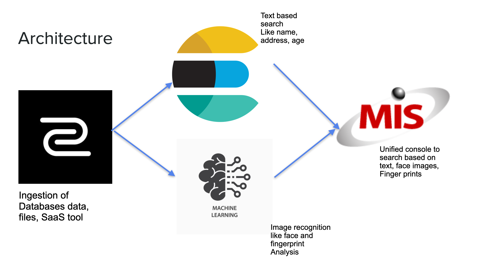

# ksp-submission
This repository is created for Karnataka State Police Hackathon 2023 - submission collection. 
## Team Information

### Team Name - Datazip

### Live Application URL : https://agreeable-stone-0b2d08010.2.azurestaticapps.net/

### Problem Statement - Unified Data Verification

### Inspiration

Datazip started out as a end-to-end no-code data unification and analytics product. This problem was already existing in the current world, we wanted to take it head on and work on a solution which would be suitable for the police department too along with serving the main purpose of data unification and its verification.

### Contents

- [Frontend Application](./Frontend)
- [Machine Learning Service](./MLS)

### What it does

1. Datazip has ingestion tool which supports more than 150 data sources which includes all the popular databases like MySQL, PostgreSQL, MongoDB, files like .csv, .parquet, and more.

2. We injest the data into centralized data warehouse or a search engine

3. We have also created a feature for running face and fingerprint recognition.

4. We are combining all the results from the above steps therefore unifying the results from various data sources and help the Police Department access it from one place.

5. We calculate feature vectorsg on the datasets from the databases by running the `FacialRecogDataPreparation.py` and `FingerDataPreparation.py` file. This outputs .csv and .npy files which are used in `ImageRecognitionEndpoint.py` file. 

## HOW TO RUN
1. Run the UI : 
  --> Prerequisites: Node v14.18.0 or Higher
  
  --> Clone the repo and move the the folder called Frontend
  
  --> Run the react application using following commands `npm i` &  `npm run start`
  
  --> You should be able to see a console and Text search should work.

2. Text search for criminal records in provided datasets :
  --> We use `elasticsearch` as a middleware to store and search among the dataset records as a text based search
  
  --> Ingest the excel file dataset into elasticsearch via Ingestion service like Datazip. (Contact us for doing trial/POC with us at hello@datazip.io or call us at +919403613633)
  
  --> Copy elastic-search url in the https://github.com/hack2skill/ksp-submission/pull/30/files#diff-5d81de61ef6627aa4b8ac3ef48ce1c71366000127509c9a700b87e7f98220a75R94 also do not forget to change the token here https://github.com/hack2skill/ksp-submission/pull/30/files#diff-5d81de61ef6627aa4b8ac3ef48ce1c71366000127509c9a700b87e7f98220a75R42
  
  --> Restart the frontend react app ran in step 1.

3. Image search for finger print & Arrest image dataset provided
  --> Prerequisites: Python 3.8 or higher
  
  --> Now first download all the images from arrest dataset (https://drive.google.com/file/d/18OJF5bh5J9UHuXM9TL-q9nFlvfCtHTRh/view?usp=share_link)
  
  --> Segregate those images with jpg extension in jpg-folder & png extension in png-folder
  
  --> Copy `FacialRecogDataPreparation.py` in the same folder and install all dependencies like pip3 install Pillow, pip3 install tensorflow, etc (Any others as well if error comes)
  
  --> run `python3 FacialRecogDataPreparation.py`. This should generate the `faces_image_score.npy` and `faces_image_names.csv`
  
  --> Similarly download all images in kaggle finger print dataset https://www.kaggle.com/datasets/ruizgara/socofing
  
  --> run `python3 FingerDataPreparation.py`. This should generate the `finger_image_score.npy` and `finger_image_names.csv`
  
  --> Now copy all generated npy & csv files into a new folder and copy `ImageRecognitionEndpoint.py` file there.
  
  --> run server like python3 ImageRecognitionEndpoint.py
  
  --> Now this server is running on 5000 port.
  
  --> Copy the url of the server and paste it in https://github.com/hack2skill/ksp-submission/pull/30/files#diff-5d81de61ef6627aa4b8ac3ef48ce1c71366000127509c9a700b87e7f98220a75R135 and https://github.com/hack2skill/ksp-submission/pull/30/files#diff-5d81de61ef6627aa4b8ac3ef48ce1c71366000127509c9a700b87e7f98220a75R159
  
  --> Restart the react server to update the website with image recognition features as well.

### Tech Stack

1. Microsoft Azure
2. ImageNet
3. Azure ML Notebooks
4. Azure App Services - For Deploying the Frontend
5. ReactJS - UI Library
6. Node/NPM
7. MaterialUI - UI Components
8. JavaScript - Frontend
9. Firebase - Authentication
10. Python - Backend
11. Airbyte
12. ElasticSearch - To Power the Search

### What's next for Datazip

1. We would want to offer a full fledged lake house architecture with natural extension for machine learning use cases.
2. We would also add easier data transformations
3. We would also want to make the whole product end to end auto-scalable

 

