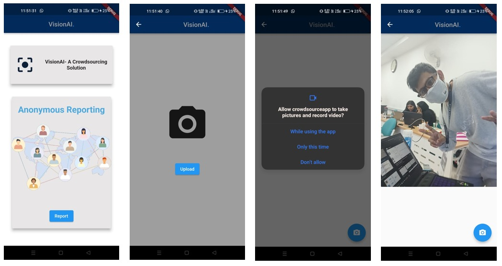
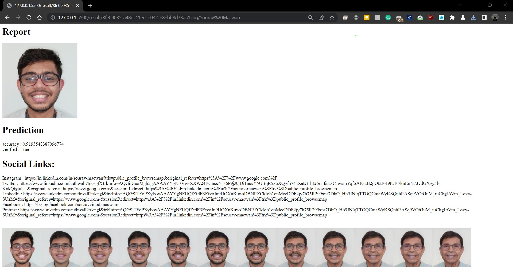

# ksp-submission- The Codebusters
This repository is created for Karnataka State Police Hackathon 2023 - submission collection. 
## Team Information
### Team Name - The Codebusters
### Problem Statement - AI-Face Detection

#### Description: Karnataka State Police is looking for a solution where a facial recognition algorithm and API (Application Programming Interface) will integrate with live databases and Social Media Platforms to detect the face of the missing person by scanning through the police databases as well as internet/social media platforms, (minimum 3) to identify and match the missing person image provided by the department.

## Team Members:

- [Khushi Ruparel - @khushi-14](https://github.com/khushi-14)
- [Girish Rajani - @girishrajani](https://github.com/girishrajani)
- [Sourav Macwan - @SouraVMacwaN](https://github.com/SouraVMacwaN)

# Features

## Highly Reliable and Accurate AI Model
Siamese Networks used to train and analyze the model. Various techniques like augmentation and scalling techniques to improve the existing dataset. Facial Time Machine made to predict person's face throught his/her lifetime.  

## All Rounder, Reliable and Scalable API
A good, fast, reliable, and scalable API that provides quick and accurate responses to requests made by clients, is available at all times, can handle increasing amounts of traffic, and can be easily integrated with other pre-existing systems. Connects and Communicates with all the end points throughout the project.

## Web Portal for the Police
Easy to use and user-friendly UI to help navigate easily.

## Crowdsourcing Android App
Android App designed in Flutter to help people anonymously report missing or wanted suspects. 

## Web Profiler
a tool used to gather and analyze data about a person's online presence on various social media platforms. The tool typically collects information such as the user's profile information, activity history, friends, followers, and engagement with posts. This data is then used to create a comprehensive profile of the user's social media behavior.

